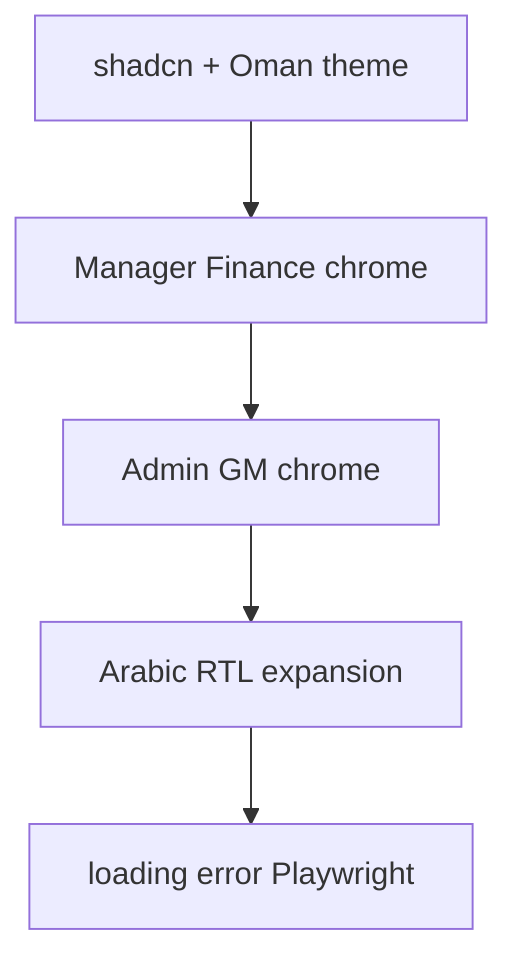

# موجة المكاتب الخلفية + shadcn + تعريب + جودة

## القرار المثبت

- **المكدس:** ترحيل تدريجي إلى **shadcn/ui** فوق **Next.js 15 App Router + React 19 + Prisma 7 + PostgreSQL** الحالي.
- **ليس** إعادة بناء ERP من الصفر — الدومين (فواتير، أسطوانات، عملة ائتمان، صلاحيات، تدقيق) يبقى كما هو في `app/actions/`* و`lib/*` و`prisma/`.
- **الهوية:** الحفاظ على توكنات عمان الميدانية (تيل/فولاذ + برتقالي سلامة) عبر ثيم shadcn (`--brand` / CSS variables) وليس indigo الافتراضي.
- **لا Clerk** — الإبقاء على JWT/جلسة المشروع الحالية.

---

## المرحلة 0 — أساس shadcn + طبقة توافق

1. تثبيت shadcn (Tailwind v3 الحالي، `components.json`، Radix primitives اللازمة).
2. إضافة مكوّنات أساسية: `Button`, `Input`, `Label`, `Card`, `Table`, `Dialog`, `Sheet`, `DropdownMenu`, `Tabs`, `Badge`, `Select`, `Textarea`, `Separator`, `Skeleton`.
3. ضبط ثيم عمان في `:root` / `tailwind.config.ts` ليتوافق مع [app/globals.css](app/globals.css) و`[.cursor/skills/sales-oman-ui/SKILL.md](.cursor/skills/sales-oman-ui/SKILL.md)`.
4. **طبقة توافق مؤقتة:** الإبقاء على واجهات [components/ui/](components/ui)* (`Button`, `PageHeader`, `TopNav`, `Field`, `Stat`, `Card`) كأغلفة رفيعة فوق shadcn حتى لا تنكسر صفحات الميدان دفعة واحدة.
5. تحديث مهارة `sales-oman-ui` لتوثيق shadcn + التوكنات + قواعد عدم البنفسجي.

**مخرجات:** shadcn يعمل؛ الميدان ما زال أخضر؛ لا تغيير منطق أعمال.

---

## المرحلة 1 — Manager + Finance (أولوية تشغيل يومي)

ترحيل بقايا `bg-slate-50` وأزرار `bg-slate-950` إلى `bg-app-bg` + `PageHeader` + مكوّنات shadcn/التوافق:

| مسار                                                                                         | حالة حالية تقريبية            |
| -------------------------------------------------------------------------------------------- | ----------------------------- |
| [app/manager/dashboard/page.tsx](app/manager/dashboard/page.tsx)                             | `bg-slate-50` — أولوية        |
| [app/manager/settings/page.tsx](app/manager/settings/page.tsx)                               | `bg-slate-50`                 |
| [app/finance/reconciliation-overview/page.tsx](app/finance/reconciliation-overview/page.tsx) | `bg-slate-50`                 |
| صفحات manager/finance نصف مُرحَّلة                                                           | مراجعة خفيفة للجداول والنماذج |

الالتزام بـ RTL-ready (اتجاه من `html dir`) وأهداف لمس معقولة على اللوح.

---

## المرحلة 2 — Admin + GM

نفس نمط الترحيل للشاشات الإدارية المتبقية:

- [app/admin/branches/page.tsx](app/admin/branches/page.tsx)
- [app/admin/roles/page.tsx](app/admin/roles/page.tsx)
- [app/admin/products/page.tsx](app/admin/products/page.tsx)
- [app/admin/inventory/page.tsx](app/admin/inventory/page.tsx)
- صفحات admin أخرى (users/sales/finance إن وُجدت بـ slate)
- مراجعة [app/admin-console/page.tsx](app/admin-console/page.tsx) و[app/general-manager/*](app/general-manager) للتناسق مع shadcn
- استبدال تدرج indigo في `PresentationLink` إن بقي

استخدام `Table`/`Dialog`/`Sheet` من shadcn للجداول الكثيفة وقوائم الصلاحيات ([PermissionChecklist](app/admin/roles/PermissionChecklist.tsx)).

---

## المرحلة 3 — تعريب / RTL أوسع

توسيع [lib/i18n.ts](lib/i18n.ts) فقط (لا نظام i18n ثانٍ):

1. جرد سلاسل Manager / Loader / Admin / GM / Finance الظاهرة للمستخدم.
2. إضافة مفاتيح `t()` تدريجياً حسب الدور (ميدان أولاً مكتمل، ثم مدير، ثم أدمن).
3. التحقق من جداول ونماذج تحت `dir="rtl"` (محاذاة أرقام العملة تبقى LTR حيث يلزم عبر `tabular-nums` / `dir="ltr"` على المبالغ).
4. `LocaleToggle` في layouts الأدوار الرئيسية إن لم يكن موجوداً.

هدف الجولة: تغطية تشغيلية كاملة للنصوص الظاهرة — ليس ترجمة تعليقات الكود أو رسائل السيرفر الداخلية كلها.

---

## المرحلة 4 — جودة: shells + Playwright + a11y خفيف

1. إضافة `loading.tsx` / `error.tsx` لـ:
  - `app/manager`, `app/loader`, `app/finance`, `app/admin`, `app/general-manager`, `app/logistics`
   (نمط موجود في [app/salesman/loading.tsx](app/salesman/loading.tsx) / [error.tsx](app/salesman/error.tsx))
2. توسيع Playwright (`tests/e2e/`):
  - فاتورة → دين → مصالحة
  - تحميل/إرجاع لودر
  - انتحال tester إن كان مستقراً
3. فحص a11y سريع على النماذج الكثيفة (تسميات، تركيز، تباين) وفق web-design-guidelines دون إعادة تصميم كاملة.
4. إبقاء `npm test` أخضر؛ توسيع اختبارات أسلوب shadcn/التوكنات.

---

## المرحلة 5 — إنهاء طبقة التوافق

بعد استقرار الصفحات:

1. إزالة الأغلفة المكررة حيث يكفي الاستيراد المباشر من `@/components/ui` (shadcn).
2. الإبقاء على `TopNav` / `PageHeader` كمكوّنات منتج فوق shadcn إن بقيت قيماً مضافة.
3. تحديث Knowledge-Sales بملاحظة موجة shadcn + المكاتب الخلفية.

---

## ما لن نفعله

- إعادة بناء منطق المحاسبة/الأسطوانات/الصلاحيات من الصفر.
- إدخال Clerk أو استبدال Prisma.
- خلط vault المبيعات مع Knowledge الكاميرات.
- تعريب رسائل أخطاء النظام الداخلية غير الظاهرة للمستخدم في هذه الجولة.

---

## ترتيب التنفيذ والتحقق

لكل مرحلة: تغييرات UI فقط أولاً → `npm test` + `typecheck` → تحقق متصفح ~1280 (وموبايل حيث ينطبق على المدير) → انتقال للمرحلة التالية.