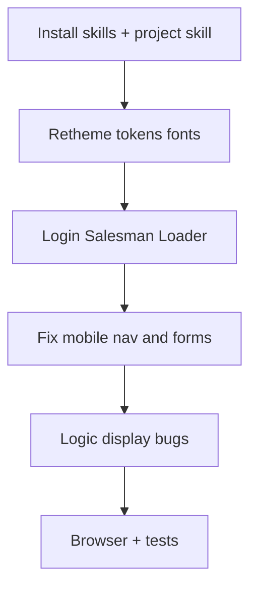

# خطة تمييز ميداني + مهارات + فحص بنية

## القرارات المثبتة

- **الهوية:** جديدة — غاز عماني ميداني (فولاذ/تيل صناعي + برتقالي سلامة)، **ليس** indigo/violet الحالي.
- **أولوية الواجهة:** تسجيل الدخول + البائع + اللودر/المصالحة الميدانية (موبايل أولاً، ثم سطح المكتب).
- **لا إدخال shadcn/Clerk** — الإبقاء على `[components/ui](components/ui)` وإعادة تلوين التوكنات فقط.

---

## المرحلة 0 — مهارات Cursor

**تثبيت (مفيد فعلاً لهذا الريبو):**

| مهارة                                               | لماذا                                                         |
| --------------------------------------------------- | ------------------------------------------------------------- |
| `npx skills add prisma/skills`                      | مشروع على Prisma 7؛ يقلل أخطاء API/migrations                 |
| مهارة مشروع `.cursor/skills/sales-oman-ui/SKILL.md` | توثيق الهوية الجديدة، التوكنات، قواعد الموبايل، وعدم البنفسجي |

**موجود مسبقاً ويُستخدم دون إعادة تثبيت:** `ui-implementation` (تعديل ليشير لـ Sales لا cam فقط عند العمل هنا)، `frontend-design`, `web-design-guidelines`, `webapp-testing`, `vercel-react-best-practices`.

**لن نثبت:** `product-builder` / قوالب shadcn+Clerk — تتعارض مع المكدس الحالي.

بعد التثبيت: تحديث ملاحظة في `/home/mahmoud/Knowledge-Sales` عن المهارات + الهوية.

---

## المرحلة 1 — نظام التصميم الجديد (توكنات فقط)

ملفات الأساس:

- `[tailwind.config.ts](tailwind.config.ts)` — استبدال `brand` indigo بـ **teal/steel** (`#0f766e` عائلة) + accent سلامة `#ea580c`؛ خط عرض مميز + `Noto Sans Arabic` لـ RTL.
- `[app/globals.css](app/globals.css)` — `:root`، خلفيات `bg-app-bg` غير بنفسجية، `.ui-*`، إضافة `**ui-btn-secondary**` الناقص، تحديث LEGACY NORMALIZER.
- `[app/layout.tsx](app/layout.tsx)` — `themeColor` + تحميل الخطوط.
- `[components/ui/*](components/ui)` — ضبط الظلال/الحواف لتطابق الهوية دون تغيير API.

اتجاه بصري ثابت: فاتح ميداني نظيف، أهداف لمس كبيرة، بدون بطاقات زائدة في الهيرو، بدون glow/بنفسجي.

---

## المرحلة 2 — واجهة الميدان (موبايل + ديسكتوب)

### TopNav موبايل — `[components/ui/TopNav.tsx](components/ui/TopNav.tsx)`

- قائمة طيّ (hamburger) تحت `md` بدل `flex-wrap` المكتظ.
- إزالة `bg-purple-600` من `[AdminConsoleLink](components/AdminConsoleLink.tsx)` في layouts البائع/اللودر — استخدام `ui-nav-link`.

### تسجيل الدخول — `[app/login/](app/login/)`

- تطبيق التوكنات الجديدة؛ إضافة `LocaleToggle`؛ تحسين المسافات على ~390px.

### البائع

| ملف                                                               | إصلاحات                                                                                           |
| ----------------------------------------------------------------- | ------------------------------------------------------------------------------------------------- |
| `[app/salesman/page.tsx](app/salesman/page.tsx)`                  | `PageHeader`/`Stat`/`ui-card`؛ إزالة تكرار الدفعات؛ `formatMoney` بدل OMR الثابت                  |
| `[history/page.tsx](app/salesman/history/page.tsx)`               | نفس النظام + `ui-table`                                                                           |
| `[NewInvoiceForm.tsx](app/salesman/new-order/NewInvoiceForm.tsx)` | إزالة هيدر `bg-ink` المزدوج؛ **إلغاء `min-w-[760px]`** — شبكة عمودية على الموبايل؛ أزرار `ui-btn` |
| `[customer/[id]/page.tsx](app/salesman/customer/[id]/page.tsx)`   | إصلاح `ui-btn-secondary`؛ عرض العملة الصحيحة                                                      |
| `[receipt/...](app/salesman/receipt/[invoiceId]/page.tsx)`        | تخفيف الكروم أو تخطيط طباعة أوضح؛ أزرار موحّدة                                                    |

### اللودر + المصالحة

| ملف                                                                                                     | إصلاحات                                                                       |
| ------------------------------------------------------------------------------------------------------- | ----------------------------------------------------------------------------- |
| `[loader/page.tsx](app/loader/page.tsx)`                                                                | ضبط التوكنات الجديدة                                                          |
| `[SalesmanHandoffPicker.tsx](app/loader/SalesmanHandoffPicker.tsx)`                                     | `ui-card`/`Field`                                                             |
| `[load/](app/loader/load/[salesmanId]/page.tsx)` / `[return/](app/loader/return/[salesmanId]/page.tsx)` | `ui-input`؛ إصلاح `focus:border-brand` → `brand-500`؛ `safe-area` للزر اللاصق |
| `[logistics/reconciliation/*](app/logistics/reconciliation/)`                                           | ترحيل كامل إلى `bg-app-bg` + `PageHeader` + `ui-*` لمطابقة اللودر             |

تحقق بالمتصفح (Playwright/MCP) عند ~390 و~1280 على: login، salesman home، new-order، loader load، logistics.

---

## المرحلة 3 — بنية وأخطاء منطقية/عرض (مرافقة للميدان)

ليست إعادة كتابة محاسبة كاملة؛ إصلاحات مرتبطة بما يظهر في الميدان وما بقي من الـ audit:

1. **عرض العملة:** توحيد صفحات البائع على `[lib/money.ts](lib/money.ts)` `formatMoney(amount, currency)` بدل `formatOmr` المحلي الذي يكذب عند USD/AED.
2. **ائتمان العميل في UI:** عند وجود رصيد/دين، تعطيل أو قفل مبدّل العملة في النموذج ليتوافق مع `[lib/accounting-currency.ts](lib/accounting-currency.ts)` (الرسالة تظهر من السيرفر فقط اليوم).
3. **مراجعة سريعة** لمسارات load/return/createOrder بحثاً عن انحدار بعد تغييرات الواجهة (لا تغيير منطق الأقفال إلا عند اكتشاف خلل مؤكد).
4. اختبارات انحدار: توسيع `[tests/ui-style.test.ts](tests/ui-style.test.ts)` للتوكنات الجديدة؛ اختبار غياب `min-w-[760px]`؛ تشغيل `npm test`.

تأجيل موجات الأدمن/GM/المالية الكاملة إلى جولة لاحقة (بعد موافقتك)، مع انتقال جزئي تلقائي عبر التوكنات العامة.

---

## ما لن نفعله في هذه الجولة

- تعريب كامل لكل الشاشات (الإبقاء على أساس i18n + توسيع مفاتيح الميدان فقط).
- استبدال المكدس بـ shadcn أو إعادة بناء ERP من الصفر.
- خلط vault المبيعات مع Knowledge الكاميرات.

