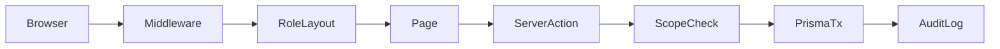

# خطة فهم، توثيق، وتطوير Sales Project

## ما فهمته عن المشروع

منصة ERP فرعية لشركة غاز عمانية (beta): **Next.js 15 / React 19 / Prisma 7 / PostgreSQL 16**، تهدف لمراقبة موحدة وتسهيل عمل البائع في الميدان (عملاء جدد، فواتير، طباعة) مع مسارات Loader / Manager / Finance / Admin / GM.

| دور              | سطح العمل                               | جوهر المهمة                |
| ---------------- | --------------------------------------- | -------------------------- |
| SALESMAN         | `/salesman`                             | فاتورة ميدانية، دين، طباعة |
| LOADER           | `/loader` + `/logistics/reconciliation` | تحميل صباحي / إرجاع مسائي  |
| MANAGER          | `/manager`                              | تسعير، تحصيل، شطب، فروقات  |
| ADMIN / GM       | `/admin*`, `/general-manager`           | إعداد وإشراف               |
| Finance (صلاحية) | `/finance`                              | كشوف ومصالحة               |

المرجع الحالي الأقوى: `[PROJECT_MAP.md](PROJECT_MAP.md)` و`[docs/PROJECT_AUDIT_2026-08-31.md](docs/PROJECT_AUDIT_2026-08-31.md)` (100 اختبار وحدة ناجحة؛ كثير من عيوب الثقة صُلحت؛ ما زال غير جاهز كمنصة محاسبة إنتاج كاملة).

---

## القرارات المثبتة منك

- **Vault منفصل:** `/home/mahmoud/Knowledge-Sales` (لا يُخلط مع `/home/mahmoud/Knowledge` الخاص بمشروع الكاميرات).
- **Graphify داخل المشروع:** `Sales_Project/graphify-out/` + تصدير Obsidian إلى الـ vault المنفصل.
- **أولوية المرحلة الأولى:** مساران معاً — استقرار المحاسبة/المخزون + تجربة البائع الميدانية.

---

## المرحلة 0 — المعرفة (Graphify + Obsidian) — أولاً قبل أي تطوير

1. تثبيت/التحقق من `graphifyy` وتشغيل خط أنابيب كامل على `/home/mahmoud/Sales_Project` بوضع `--mode deep` و`--directed`.
2. إن تجاوزت الملفات ~500 (متوقع مع `present/` والاختبارات): تضييق النطاق إلى المجلدات الجوهرية أولاً:
  - `app/`, `lib/`, `prisma/`, `components/`, `middleware.ts`, `docs/`, `PROJECT_MAP.md`, `DEPLOY.md`
  - استبعاد `present/desktop|mobile/*.png` و`node_modules` و`.next` من الاستخراج الثقيل إن لزم.
3. تصدير:
  - HTML: `graphify-out/graph.html`
  - تقرير: `graphify-out/GRAPH_REPORT.md`
  - Obsidian: `graphify export obsidian --dir /home/mahmoud/Knowledge-Sales`
4. كتابة ملاحظات ذاكرة دائمة (عربي مقبول) في الـ vault المنفصل بروابط `[[wikilinks]]`:
  - `Sales Project — Overview.md`
  - `Sales — Domain Flows.md` (فاتورة، تحميل، مصالحة، دين)
  - `Sales — Auth Trust Model.md`
  - `Sales — UI Design System.md`
  - `Sales — Beta Risks P0-P2.md`
5. تحديث مهارة الذاكرة لاحقاً لتشير إلى `/home/mahmoud/Knowledge-Sales` + `Sales_Project/graphify-out` عند العمل على هذا المشروع (بدون خلط مع cam_project).

**مخرجات المرحلة 0:** رسم بياني قابل للاستعلام + vault Obsidian تتصفحه أنت، وأنا أستطيع `graphify query` قبل أي إصلاح لاحق.

---

## المرحلة 1 — مسار مزدوج (أساسيات صحيحة + بائع ميداني)

تعمل على فرعين متوازيين؛ لا نؤجل أحدهما.

### المسار A — استقرار البنية والمحاسبة (P0)

مستند إلى الـ audit المتبقي:

1. **نموذج ائتمان متعدد العملات** — قرار منتج ثم تنفيذ:
  - الافتراضي المختار للخطة: تقييد العميل/الفرع بعملة محاسبة واحدة (`Branch.defaultCurrency` / قيد على العميل) وإزالة تجاوز عملة الفاتورة الحر عند وجود رصيد ائتمان، *أو* إن كان العمل متعدد العملات ضرورياً ميدانياً ننتقل فوراً إلى `CustomerCurrencyBalance`.
  - الافتراضي التنفيذي هنا: **عملة محاسبة واحدة لكل عميل/فرع** (أقل خطراً للـ beta العماني OMR-أولاً)، مع الإبقاء على عرض أسعار متعددة فقط إن لم يوجد ائتمان/دين مفتوح بعملة أخرى.
2. **ذرّية User + Audit** في `[app/actions/users.ts](app/actions/users.ts)`: إعادة إنتاج مشكلة PrismaPg، ثم إعادة `$transaction` أو outbox إلزامي للتدقيق.
3. **سياسة الشطب:** عتبة + موافقة ثانية أو تقييد ADMIN/GM فقط (آلية الحساب صحيحة؛ السياسة ناقصة).

### المسار B — تجربة البائع الميدانية (الهدف الأكبر للمنتج)

ملفات محورية: `[app/salesman/new-order/NewInvoiceForm.tsx](app/salesman/new-order/NewInvoiceForm.tsx)`، `[app/salesman/page.tsx](app/salesman/page.tsx)`، طباعة `[app/print/[invoiceId]/page.tsx](app/print/[invoiceId]/page.tsx)`.

1. **تنقل ميداني:** إضافة روابط New Order / History / Customers في `TopNav` للبائع؛ إصلاح مسار `/logistics/reconciliation` ليبقي غلاف Loader.
2. **توحيد التصميم:** إنهاء الازدواجية legacy vs `components/ui` على صفحات البائع (خلفية، رؤوس، جداول) مع الحفاظ على أهداف لمس كبيرة.
3. **صفحة العميل:** أزرار طباعة + «فاتورة جديدة لهذا العميل»؛ مواءمة افتراضي الطباعة (mobile في الميدان).
4. **تفكيك النموذج الضخم (~1200 سطر):** تقسيم اختيار العميل / البنود / الدفع / الدين مع الإبقاء على مسودة `localStorage`.
5. **حالات تحميل/خطأ:** `loading.tsx` / `error.tsx` لمسارات البائع الثقيلة؛ إصلاح «Refresh» الوهمي في لوحة المصالحة.

---

## المرحلة 2 — أمان وتشغيل (P1)

- تجزئة توكن كشف الحساب (`shareToken` hashed at rest).
- التحقق من توقيع الملفات (magic bytes) للملحقات.
- نسخ احتياطي يشمل uploads + تنبيه عمر النسخ؛ تحذير عند حد تصدير التدقيق 5000.
- ترقيم صفحات All Sales؛ مراجعة صلاحيات Manager/Loader الافتراضية؛ توحيد روابط GM/Admin المشتركة.

---

## المرحلة 3 — واجهة أوسع وتعريب (بعد استقرار المسارين)

- حالياً الواجهة **إنجليزية فقط** (`lang="en-OM"`، بدون RTL). التعريب/RTL موجة لاحقة بعد استقرار تدفقات الميدان والمحاسبة حتى لا نضاعف سطح الاختبار.
- `loading`/`error` لباقي الأدوار؛ a11y للنماذج المعقدة؛ Playwright لتدفقات الطفرة (فاتورة، دين، مصالحة، impersonation).

---

## ترتيب التنفيذ العملي عند الموافقة

1. تشغيل Graphify + تصدير Obsidian إلى `/home/mahmoud/Knowledge-Sales` + ملاحظات الذاكرة.
2. جلسة تحقق قصيرة معك عبر `graph.html` / Obsidian (أسئلة من التقرير).
3. بدء المرحلة 1 بمسارين متوازيين (PRs صغيرة إن رغبت لاحقاً عبر split-to-prs).
4. عدم المساس بـ `.env` أو أسرار؛ الالتزام باختبارات الانحدار الموجودة وتوسيعها لكل إصلاح P0/ميداني.

## ما لن نفعله في هذه الخطة

- خلط vault المبيعات مع Knowledge الخاص بمشروع آخر.
- إعادة كتابة كاملة من الصفر (الكود لديه أساس ثقة قوي بعد تدقيق آب/أيلول).
- تعريب كامل قبل تثبيت المحاسبة وتجربة البائع.

