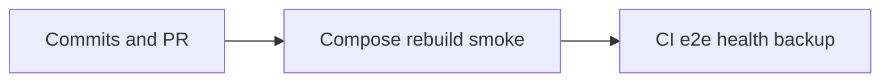

# إطلاق: Commit/PR + نشر + تشغيل مستمر

## القرار المثبت

- العمل على فرع `release/oman-ui-ops` من الحالة الحالية (يشمل الـ 24 commit المحلية غير المدفوعة + التغييرات غير المُلتزَمة)، ثم **PR إلى `main`** على `origin`.
- النشر محلياً عبر **Docker Compose** وفق [DEPLOY.md](DEPLOY.md) (شبكة `docker_shared` + Cloudflare tunnel موجودة) — بدون منصّة نشر جديدة.
- تشغيل مستمر داخل الريبو: تفعيل E2E في CI + سكربت دخان للصحة + توثيق نسخ احتياطي خارج الحجم.

---

## المرحلة 1 — Git: commits + PR

الوضع: `main` متقدم ~24 عن `origin/main` + شجرة dirty كبيرة (ميدان، shadcn، i18n، اختبارات، مهارات…).

1. إنشاء فرع `release/oman-ui-ops` من HEAD الحالي.
2. تنظيم الـ dirty tree في commits منطقية (بدون أسرار `.env`، وبدون `graphify-out/cache` الثقيل إن أمكن استثناؤه):
  - هوية عمان + ميدان + shadcn/مكاتب
  - i18n/RTL + shells + اختبارات أسلوب
  - جاهزية إنتاج + Playwright operational + مستندات Knowledge إن لزم
3. `git push -u origin release/oman-ui-ops`
4. `gh pr create` نحو `main` بملخص الموجات الثلاث + خطة اختبار.
5. بعد موافقة الدمج: دمج PR (أنت أو عبر `gh pr merge` عند طلبك الصريح).

---

## المرحلة 2 — نشر الإنتاج (هذا الجهاز / السيرفر الحالي)

وفق [DEPLOY.md](DEPLOY.md) و[docker-compose.yml](docker-compose.yml):

1. التحقق من `.env`: `APP_ORIGIN=https://sales.mahmoudbox.com` (أو الأصل العام الفعلي)، أسرار JWT/DB كما هي.
2. `docker compose build web` ثم `docker compose up -d web` (و`db`/`backup`/`maintenance` إن لزم).
3. انتظار health: `docker compose ps` + طلب داخلي لـ `/api/health` من داخل الحاوية أو عبر الأصل العام.
4. دخان حي عبر المتصفح/Playwright ضد الأصل العام (أو المنفذ الداخلي إن الـ tunnel يعكسها):
  - login
  - salesman home
  - مسار خفيف loader أو new-order
5. تأكيد أن CSP الإنتاج لا يتضمن `unsafe-eval` (رؤوس الاستجابة على HTTPS).

لا تغيير بنية الـ tunnel خارج الريبو.

---

## المرحلة 3 — تشغيل مستمر

### CI — تفعيل E2E

تحديث [.github/workflows/ci.yml](.github/workflows/ci.yml):

- إضافة job `e2e` مع خدمة Postgres 16، تثبيت Playwright، تشغيل `npm run test:e2e` (أو مجموعة `operational-quality` + `accounts` إن كان الوقت محدوداً).
- الإبقاء على job `verify` الحالي سريعاً كما هو.
- ضبط `APP_ORIGIN` و`SEED_DEMO_PASSWORD` عبر GitHub Secrets للـ e2e (أسماء موثّقة في OPERATIONS).

### صحة ومراقبة

- إضافة [scripts/health-smoke.sh](scripts/health-smoke.sh): يستدعي `$APP_ORIGIN/api/health` ويتوقع `status=ok`، يصلح لـ cron أو CI بعد النشر.
- تحديث [docs/OPERATIONS.md](docs/OPERATIONS.md) بسطر cron مثال + قائمة دخان بعد النشر.

### نسخ احتياطي خارج الجهاز

- الإبقاء على خدمة `backup` في compose.
- إضافة قسم قصير في OPERATIONS: نسخ دوري لـ volume backups إلى مسار خارج المضيف (rsync/SCP)، مع تذكير أن الحجم المحلي وحده غير كافٍ للـ DR.
- إن وُجد سكربت نسخ جاهز في `scripts/` يُوسَّع؛ وإلا سكربت `scripts/offhost-backup-reminder.sh` يطبع قائمة أحدث dumps ويخرج غير صفري إن تجاوز العمر عتبة.

### معرفة

- ملاحظة قصيرة في Knowledge-Sales: `Sales — Ship Deploy Ops.md` تربط PR + نشر + مراقبة.

---

## ما لن نفعله

- استبدال Cloudflare/Docker بمنصة أخرى.
- force-push إلى `main`.
- تضمين `.env` أو كاش Graphify الضخم في الـ commits.
- تشغيل `gh pr merge` تلقائياً دون تأكيدك بعد فتح الـ PR.

---

## تحقق النجاح

- PR مفتوح على GitHub مع CI أخضر (verify + e2e إن اكتمل إعداد الأسرار).
- حاوية `sales_nextjs` healthy و`/api/health` يعيد ok على الأصل العام.
- دخان login يعمل بعد إعادة البناء.

